# AgriBoost: AI and IoT-Based System to Enhance Sugarcane Production

 

---

## Project Overview

**AgriBoost** is an AIoT-based platform designed to enhance sugarcane production by combining:

1. **AI-based Plant Disease Detection**  
   - Uses a **CNN model** to detect sugarcane diseases from leaf images.
2. **IoT-based Soil Monitoring**  
   - Uses sensors to monitor **pH, moisture, temperature** in real-time.
   - Predicts soil health and provides actionable fertilizer recommendations using a **Random Forest model**.

The system consists of:

- **Backend (Django):** Handles AI model inference, IoT data processing, and APIs.  
- **Frontend (ReactJS + Vite):** Provides an interactive dashboard for farmers.  
- **Database & Storage:** Firebase for IoT data and model storage.

---

## Architecture


**Flow:**

1. Farmer uploads plant images → CNN model predicts disease → Shows recommended actions.  
2. IoT sensors collect soil data → Random Forest model predicts fertilizer suggestions → Dashboard visualization.

---
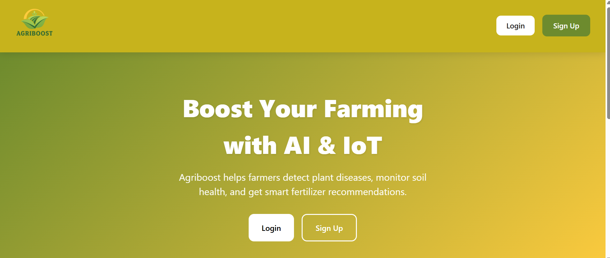 
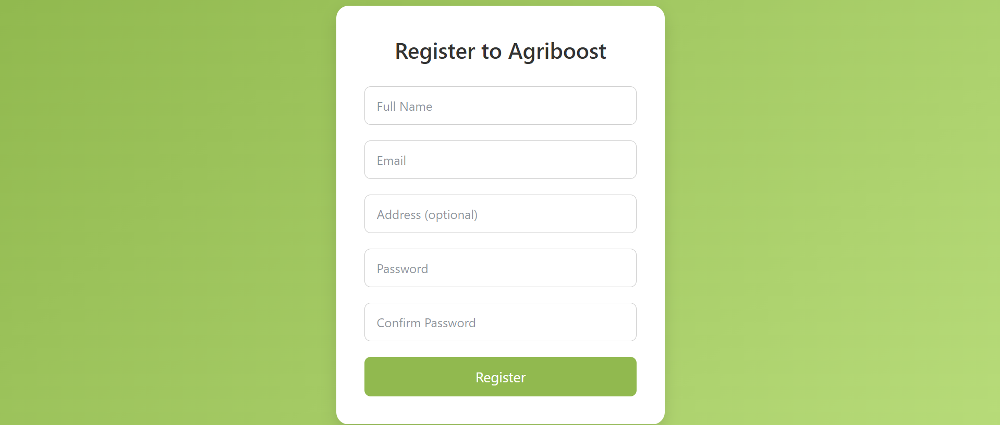 
 
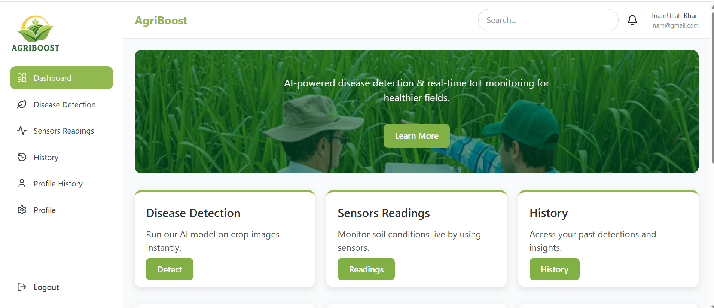 
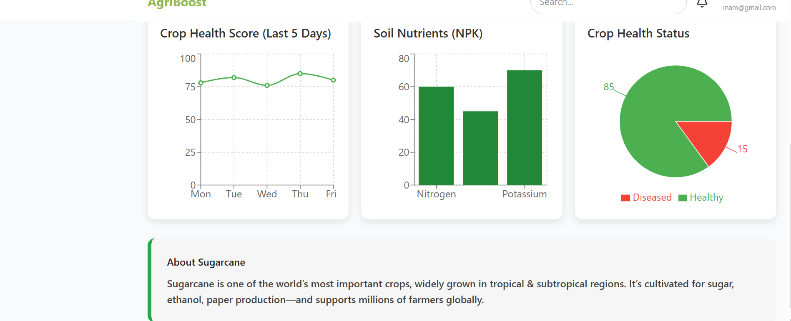 
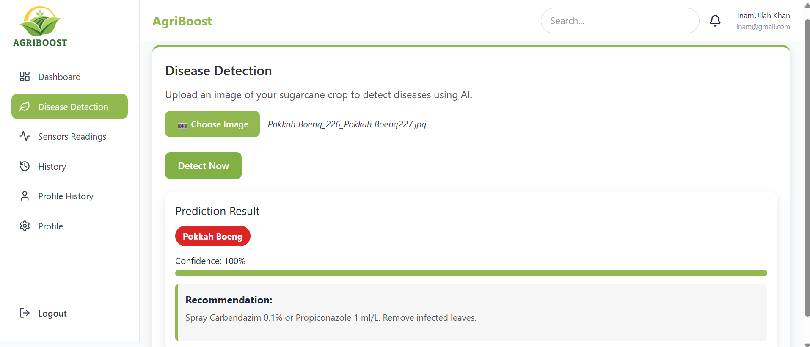 
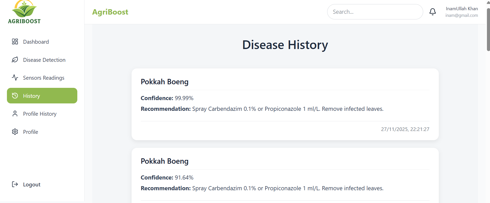 
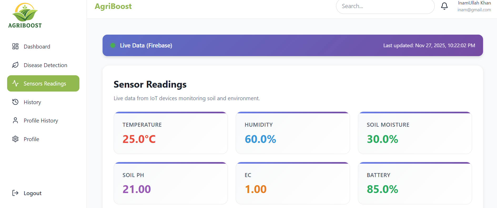 
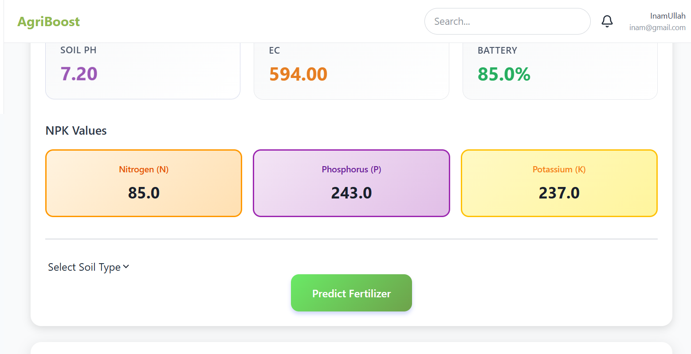 
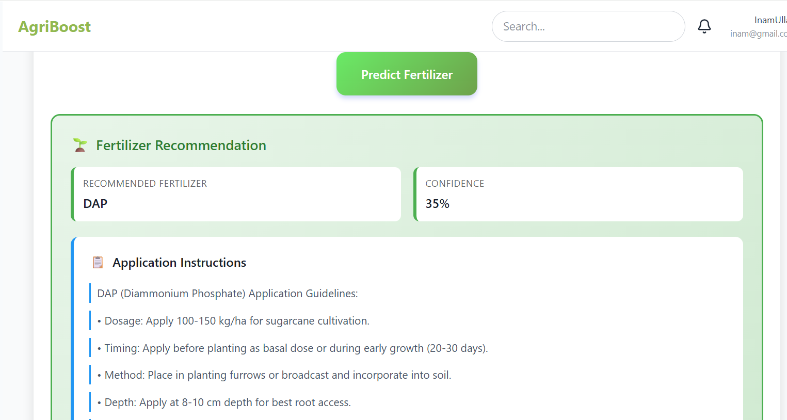 
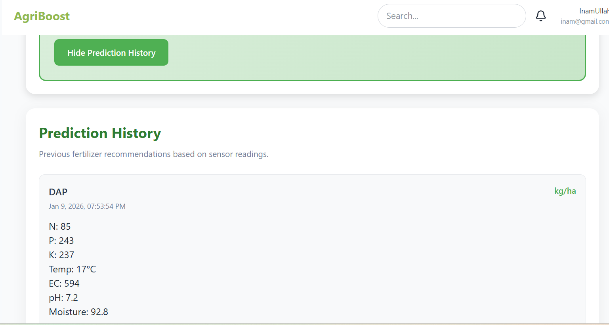 
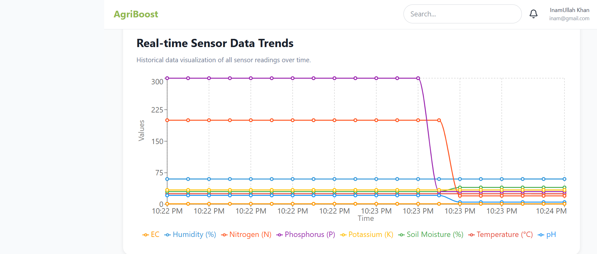 
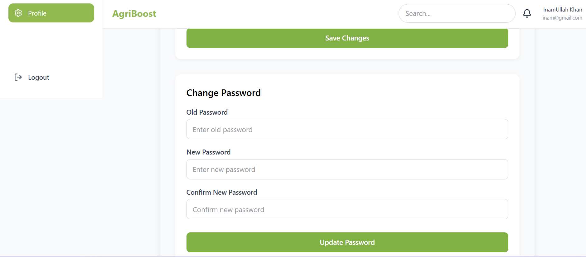 
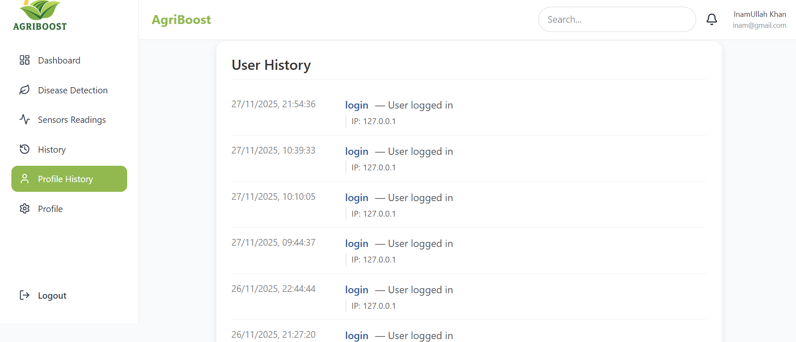 


## Setup Instructions

### 1. Clone the Repository
```bash
# 1. Clone the repository
git clone https://github.com/inamkj/Agriboost.git
cd Agriboost

# 2. Setup Backend
cd backend

# Create virtual environment
python -m venv venv310

# Activate virtual environment (Windows)
venv310\Scripts\activate

# If Linux / Mac, use:
# source venv310/bin/activate

# Install dependencies
pip install -r requirements.txt

# Run migrations
python manage.py migrate

# Start backend server
python manage.py runserver

# 3. Setup Frontend
cd ../frontend

# Install dependencies
npm install

# Start frontend server
npm run dev

